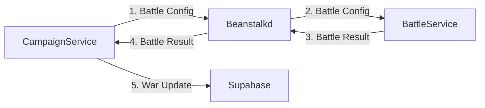

# Multiplayer Server

The multiplayer server is super simple, like everything else in this project I tried to keep it basic.

## Campaign Server

The Campaign server consists of a node js program and a beanstalkd queue.

The nodejs program generates a galaxy and hits the supabase db for user info. It seeds the stars with users, this is their
"starting system" the program then starts looping over all the active systems and taking turns for the players. Collecting their resources,
conquering nearby systems, and attacking enemies.

When a nearby system is occupied, a user can attack it. This queues up a game to the beanstalk queue. The queue can only have 5 games queued at a time.

https://xobotyi.github.io/node-beanstalk

## Battle Server

The Battle server just listens to the queue and pulls down a job. It loads up a game and runs it to completion, then returns the endgame data to the 
campaign server.




## Deploying to Raspberry PI

The Raspberry pi is a constrained environment. Docker is too much overhead + too unreliable with my shitty wifi. The crappy wifi means that not every call to Supabase is going to make it through. Game state info needs to be held locally until a successful post request to the DB can be made.

- [x] Add documentation for how to get started on Raspberry Pi
- [x] Create a single bash script to run the campaign, beanstalk, and battle server
- [x] Make the connections to supabase more robust with exception handling and stuff
- [x] Fix the crashing bug

### Setup

```
 export DROPLET_IP=localhost
 export SUPABASE_SECRET_KEY=""
```

Download [Beanstalkd](https://beanstalkd.github.io/download.html)

```
sudo apt-get install beanstalkd
```

To test, run

```
beanstalkd -l localhost -p 11300
```

Make sure node v16 and npm are installed

```
curl -sSL https://deb.nodesource.com/setup_16.x | sudo -E bash -
sudo apt-get install -y nodejs
```

### Running
Run w/ the bash script


## Deploying to DigitalOcean

Deployment is currently manual

### Detaching from console

[https://askubuntu.com/questions/8653/how-to-keep-processes-running-after-ending-ssh-session](https://askubuntu.com/questions/8653/how-to-keep-processes-running-after-ending-ssh-session)

Use screen to create a detachable command. Type screen, 
then run your command. After it has started, press CTRL + A then CTRL + D to detach. 

### Campaign
1. Clone the repo to your Droplet
2. cd into the multiplayer folder
3. In ./campaign_server run docker-compose up to run the campaign server. You will need to set the environment variables:
```
 export DROPLET_IP=""
 export SUPABASE_SECRET_KEY=""
```
Where DROPLET_IP is the IP of the current droplet

### Battle
1. Clone the repo to your Droplet
2. cd into the multiplayer folder
3. In ./battle_server run docker-compose up to run the battle server. You will need to set the environment variables:
```
 export DROPLET_IP=""
```
Where DROPLET_IP is the IP of the campaign droplet

